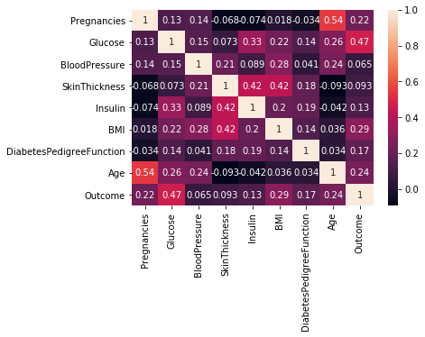

# Diabetes-Prediction
- This Notebook will help predict the chances of a women having Diabetes based on input provided. 

## Data Information:
- Downloaded from [Kaggle](https://www.kaggle.com/uciml/pima-indians-diabetes-database)
- Pregnancies: Number of times pregnant
- Glucose: Plasma glucose concentration over 2 hours in an oral glucose tolerance test
- BloodPressure: Diastolic blood pressure (mm Hg)
- SkinThickness: Triceps skin fold thickness (mm)
- Insulin: 2-Hour serum insulin (mu U/ml)
- BMI: Body mass index (weight in kg/(height in m)2)
- DiabetesPedigreeFunction: Diabetes pedigree function (a function which scores likelihood of diabetes based on family history)
- Age: Age (years)
- Outcome: Class variable (0 if non-diabetic, 1 if diabetic)
---
## EDA(Exploratory Data Analysis)
- Skinthichkness was replaced from 0 to 5mm, as minimal checkpoint
- All the values with pregency value greater than 10 was coverted to 10.
- Only Glucode value greater than 0 was taken into account
- BMI values were changed to 10 as minimal value since many had BMI=0
- Insulin Values was converted to mean, as many values were between 0-10
---
## Observation

- Relation between various parameters of the dataset.

- Women with lesser number of pregrenancy have less chances of getting Diabetes

.png)

- Women who have **high DiabetesPedigreeFunction are more likely to have Diabetes**
- With **less DiabetesPedigreeFunction**, the chances are very low (i.e when the **value is less than 0.4**)

- Elderly woman are more likely to have Diabetes.
---
## Machine Learning Algorithm
- Train and Test sizes were 70% and 30% each.
- ML model **Multiple Logistic Regression** gives us an **accuracy of 82.09%**
- **Decision Tree Classifier** gives an **accuracy_score of 71.16%**
- **RandomForestClassifier** gives us an **accuracy_score of 76.84%**
---
## Prediction 
- Prediction model was built and deployed. 

- The output '1' predicts the chances of having diabtes and '0' predicts the chances are very less

